# Helix AI Agent - 系统设计文档

> **版本**: 1.0  
> **最后更新**: 2026-06-21  
> **项目代号**: Helix  
> **技术栈**: Python 3.12+ / Flask / LangChain / LangGraph / python-pptx / MCP Protocol

---

## 目录

1. [系统概述](#1-系统概述)
2. [架构层设计](#2-架构层设计)
3. [主流程时序图](#3-主流程时序图)
4. [双循环架构 - Todo循环时序图](#4-双循环架构---todo循环时序图)
5. [双循环架构 - 子任务循环时序图](#5-双循环架构---子任务循环时序图)
6. [MCP支持设计](#6-mcp支持设计)
7. [Tool插件化设计](#7-tool插件化设计)
8. [数据模型与状态管理](#8-数据模型与状态管理)
9. [配置管理设计](#9-配置管理设计)
10. [部署与运维](#10-部署与运维)

---

## 1. 系统概述

Helix 是一个混合驱动的 AI Agent 服务，核心理念是**LLM 负责决策，工具负责执行**。系统采用双循环架构（Dual-Loop Architecture），通过 LLM 进行意图识别、任务规划、工具调用判断、数据分析和结果总结，同时支持 MCP（Model Context Protocol）协议实现外部工具的标准化接入。

### 1.1 核心设计原则

| 原则 | 说明 |
|------|------|
| **LLM 驱动决策** | LLM 是系统的"大脑"，负责任务分解、工具选择、结果分析 |
| **双循环编排** | 外层 Todo 循环管理任务进度，内层 Subtask 循环驱动具体执行 |
| **插件化工具** | 所有工具通过 BaseTool 抽象 + ToolRegistry 自动发现 |
| **MCP 标准化** | 外部工具通过 MCP 协议接入，支持 stdio 和 SSE 两种传输模式 |
| **多模型支持** | 统一 LLM 客户端，支持 Ollama / OpenAI / Gemini / DeepSeek |

---

## 2. 架构层设计

系统采用六层架构，各层职责清晰、依赖方向单一向下。

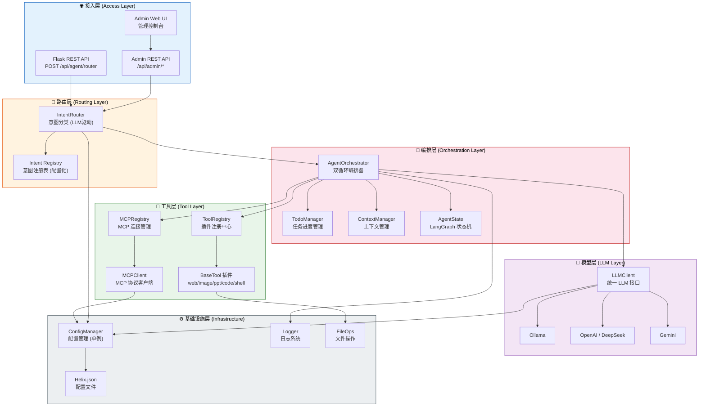

### 2.1 各层职责

| 层级 | 模块 | 职责 |
|------|------|------|
| **接入层** | `server.py`, `routes.py` | HTTP 端点暴露、请求解析、响应封装、Admin UI |
| **路由层** | `intent_router.py` | LLM 驱动的意图分类，配置化的意图注册与启停 |
| **编排层** | `orchestrator.py`, `todo_manager.py`, `context_manager.py`, `agent_state.py` | 双循环编排、任务状态追踪、上下文构建 |
| **工具层** | `tool_base.py`, `plugins/*`, `mcp_client.py`, `mcp_registry.py` | 插件化工具管理、MCP 协议通信 |
| **模型层** | `llm_client.py` | 多 LLM Provider 统一接口、JSON 模式、Tool Calling |
| **基础设施层** | `config_manager.py`, `logger.py`, `file_ops.py` | 配置读写、日志、文件 IO |

---

## 3. 主流程时序图

描述一个完整请求从用户发起到最终响应返回的全生命周期。

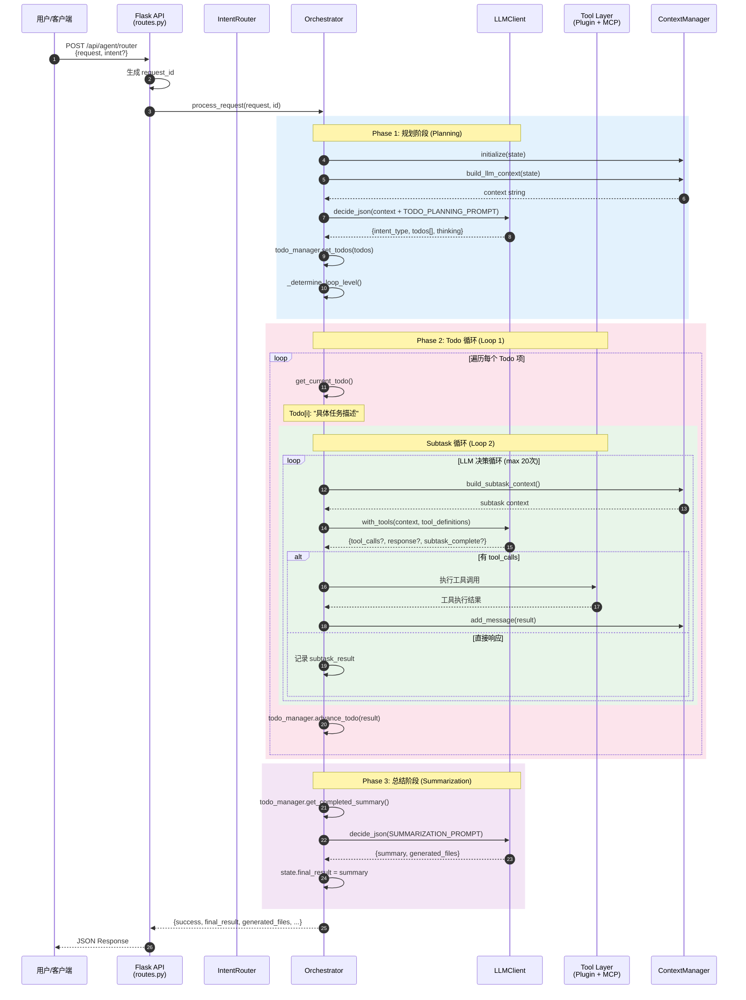

---

## 4. 双循环架构 - Todo循环时序图

Todo 循环（Loop 1）是外层循环，负责遍历任务清单中的每一项，对每一项调用子任务循环（Loop 2）完成具体工作。

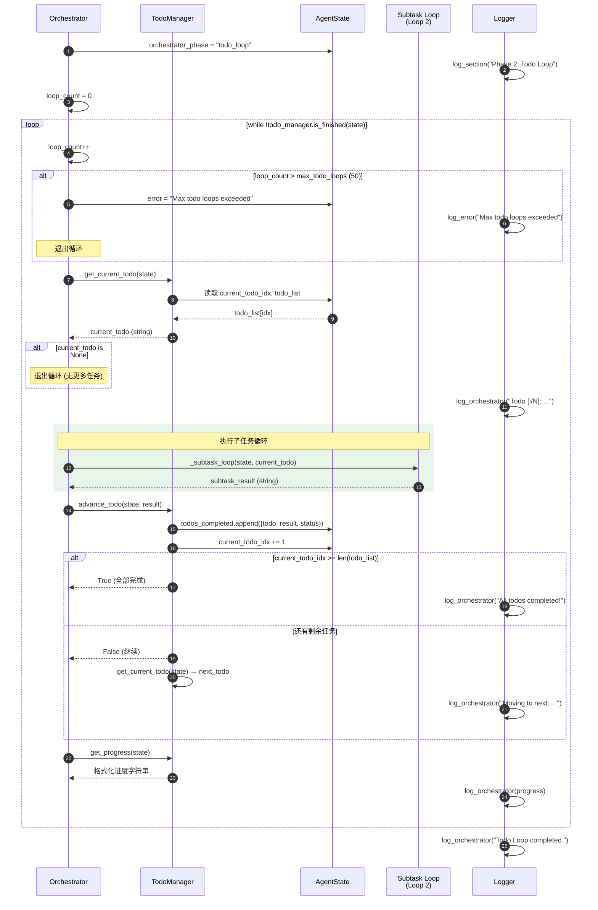

### 4.1 Todo 循环关键机制

| 机制 | 说明 |
|------|------|
| **最大循环限制** | `max_todo_loops = 50`，防止无限循环 |
| **进度追踪** | `current_todo_idx` 递增，`todos_completed` 记录历史 |
| **状态可视化** | ✅ 已完成 / 🔄 进行中 / ⬜ 待处理 |
| **结果传递** | 每个 Todo 的执行结果传递给下一个 Todo 的上下文 |

---

## 5. 双循环架构 - 子任务循环时序图

子任务循环（Loop 2）是内层循环，由 LLM 驱动决策，决定是调用工具还是直接响应，直到子任务完成或达到最大循环次数。

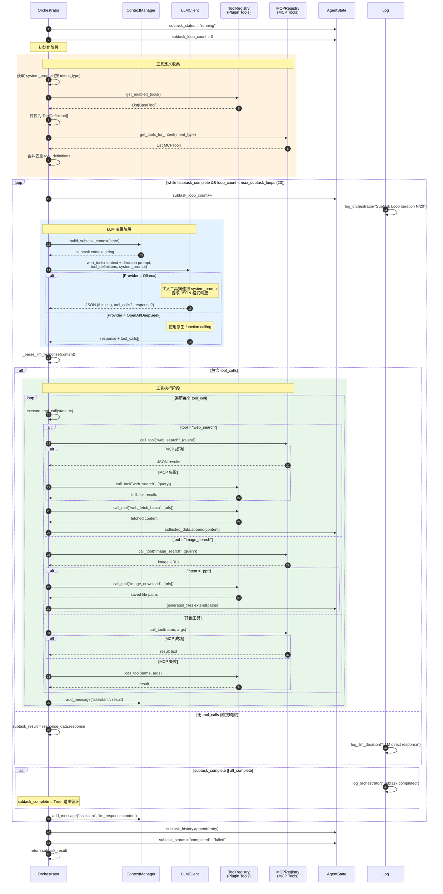

### 5.1 子任务循环关键机制

| 机制 | 说明 |
|------|------|
| **LLM 驱动决策** | 每轮循环由 LLM 决定：调用工具 / 直接响应 / 标记完成 |
| **工具优先级** | MCP 工具优先调用，失败时 fallback 到 Plugin 工具 |
| **自动链式执行** | `web_search` 自动触发 `web_fetch_batch`；`image_search` + PPT 意图自动触发 `image_download` |
| **最大循环限制** | `max_subtask_loops = 20`，防止 LLM 陷入无限决策循环 |
| **上下文累积** | 每轮结果通过 `ContextManager` 追加到对话历史，下一轮 LLM 可见 |

---

## 6. MCP支持设计

MCP（Model Context Protocol）是一种标准化的工具接入协议，Helix 实现了完整的 MCP 客户端，支持 **stdio** 和 **SSE** 两种传输模式。

### 6.1 MCP 整体架构

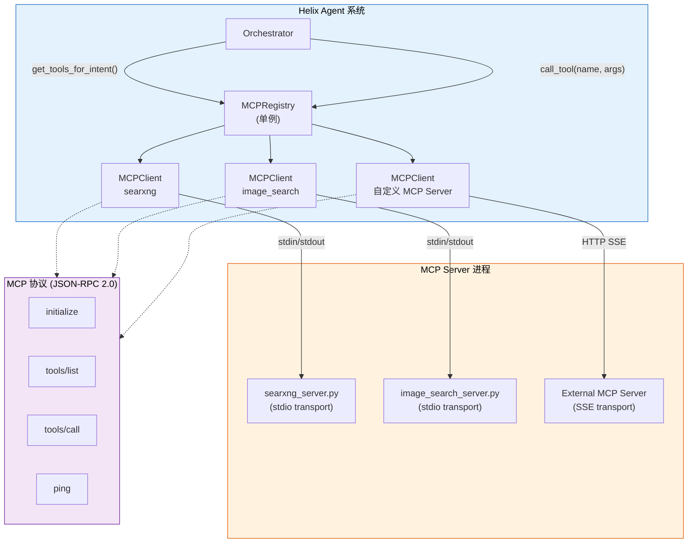

### 6.2 MCP 连接生命周期

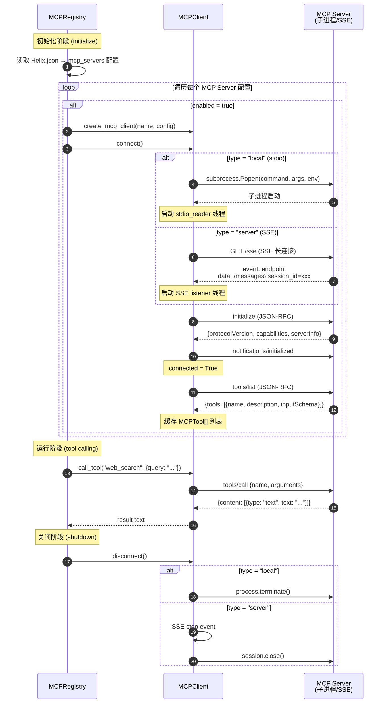

### 6.3 MCP 传输模式对比

| 特性 | stdio (local) | SSE (server) |
|------|---------------|--------------|
| **传输方式** | 子进程 stdin/stdout | HTTP SSE + POST |
| **适用场景** | 内置 MCP Server（同机部署） | 外部 MCP Server（远程部署） |
| **进程管理** | Helix 管理子进程生命周期 | 外部独立进程 |
| **通信线程** | stdio_reader 后台线程 | SSE listener 后台线程 |
| **配置方式** | `command` + `args` + `env` | `url` |
| **环境变量** | 通过 `env` 字段注入 | 由外部 Server 自行管理 |

### 6.4 MCP 意图路由

MCPRegistry 通过 `intent_categories` 实现基于意图的工具过滤：

```
MCP Server 配置:
  searxng:
    intent_categories: ["ppt", "research"]
  image_search:
    intent_categories: ["ppt", "research"]

调用时:
  get_tools_for_intent("ppt")     → [web_search, image_search]
  get_tools_for_intent("coding")  → []  (无匹配的 MCP 工具)
  get_tools_for_intent("research") → [web_search, image_search]
```

### 6.5 MCP 协议实现

Helix 实现了 MCP 协议版本 `2024-11-05`，支持以下 JSON-RPC 方法：

| 方法 | 方向 | 说明 |
|------|------|------|
| `initialize` | Client → Server | 握手，交换协议版本和能力 |
| `notifications/initialized` | Client → Server | 初始化完成通知（无响应） |
| `tools/list` | Client → Server | 发现 Server 暴露的工具 |
| `tools/call` | Client → Server | 调用指定工具 |
| `ping` | Client → Server | 心跳检测 |

### 6.6 内置 MCP Server

| Server | 文件 | 工具 | 后端 |
|--------|------|------|------|
| **SearXNG** | `mcp/searxng_server.py` | `web_search` | SearXNG 搜索引擎 API |
| **Image Search** | `mcp/image_search_server.py` | `image_search` | Pexels / Unsplash API |

---

## 7. Tool插件化设计

Helix 的工具系统采用**抽象基类 + 自动发现 + 注册中心**的插件化架构，新增工具只需在 `plugins/` 目录下添加一个 Python 文件。

### 7.1 插件化架构总览

```mermaid
graph TB
    subgraph PluginDir["plugins/ 目录 (自动扫描)"]
        WT["web_tools.py<br/>WebSearchTool<br/>WebFetchBatchTool"]
        IT["image_tools.py<br/>ImageSearchTool<br/>ImageDownloadTool"]
        PT["ppt_tools.py<br/>CreatePPTTool"]
        CT["code_tools.py<br/>SaveCodeTool<br/>RunCodeTool"]
        ST["shell_tools.py<br/>BashTool, ListFilesTool<br/>GrepTool, ReadFileTool<br/>WriteFileTool, DeleteFileTool"]
    end

    subgraph Core["核心框架"]
        BT["BaseTool (ABC)<br/>name, description<br/>category, parameters<br/>execute(**kwargs)"]
        TR["ToolRegistry (单例)<br/>register / unregister<br/>call_tool / get<br/>discover_plugins<br/>enable / disable"]
    end

    subgraph Consumer["消费者"]
        ORCH["Orchestrator<br/>_subtask_loop()"]
        ADMIN["Admin API<br/>/api/admin/plugins"]
    end

    WT -->|subclass| BT
    IT -->|subclass| BT
    PT -->|subclass| BT
    CT -->|subclass| BT
    ST -->|subclass| BT

    BT -->|注册| TR
    TR -->|get_enabled_tools()| ORCH
    TR -->|get_all_as_list()| ADMIN
    TR -->|call_tool(name, args)| ORCH
    TR -->|toggle / enable / disable| ADMIN

    style PluginDir fill:#e8f5e9,stroke:#2e7d32,color:#000
    style Core fill:#e3f2fd,stroke:#1565c0,color:#000
    style Consumer fill:#fff3e0,stroke:#e65100,color:#000
```

### 7.2 插件自动发现流程

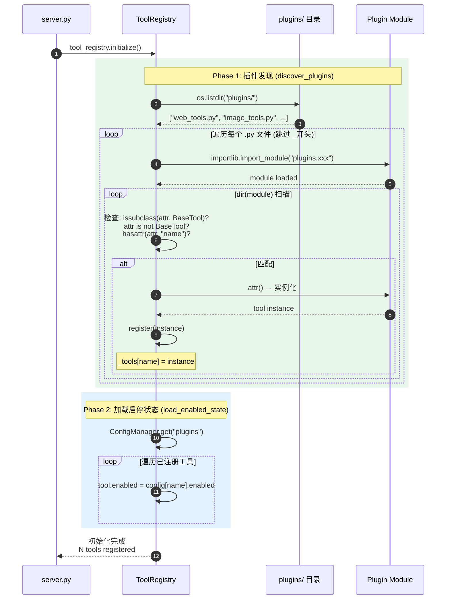

### 7.3 BaseTool 抽象基类

```python
class BaseTool(ABC):
    """所有工具插件必须继承的抽象基类"""

    name: str           # 唯一标识符 (如 "web_search")
    description: str    # 人类可读描述 (给 LLM 看)
    category: str       # 分类 (web/image/ppt/code/shell)
    parameters: dict    # JSON Schema 参数定义

    @abstractmethod
    def execute(self, **kwargs) -> Any:
        """工具执行入口"""
        pass

    def to_dict(self) -> dict:
        """序列化为 API 响应格式"""

    def to_tool_definition(self) -> dict:
        """转换为 LLM ToolDefinition 格式"""
```

### 7.4 ToolRegistry 核心能力

| 能力 | 方法 | 说明 |
|------|------|------|
| **自动发现** | `discover_plugins()` | 扫描 `plugins/` 目录，导入并注册所有 BaseTool 子类 |
| **注册/注销** | `register(tool)` / `unregister(name)` | 运行时动态管理工具 |
| **查找** | `get(name)` / `get_all()` / `get_by_category(cat)` | 按名称、全部、按分类查找 |
| **启停管理** | `set_enabled(name, bool)` / `get_enabled_tools()` | 运行时启用/禁用工具 |
| **执行** | `call_tool(name, arguments)` | 按名称调用工具，支持异常处理 |
| **持久化** | `load_enabled_state()` / `save_enabled_state()` | 启停状态持久化到 Helix.json |

### 7.5 工具与 MCP 的融合策略

在子任务循环中，Plugin 工具和 MCP 工具被统一为 `ToolDefinition[]` 提供给 LLM：

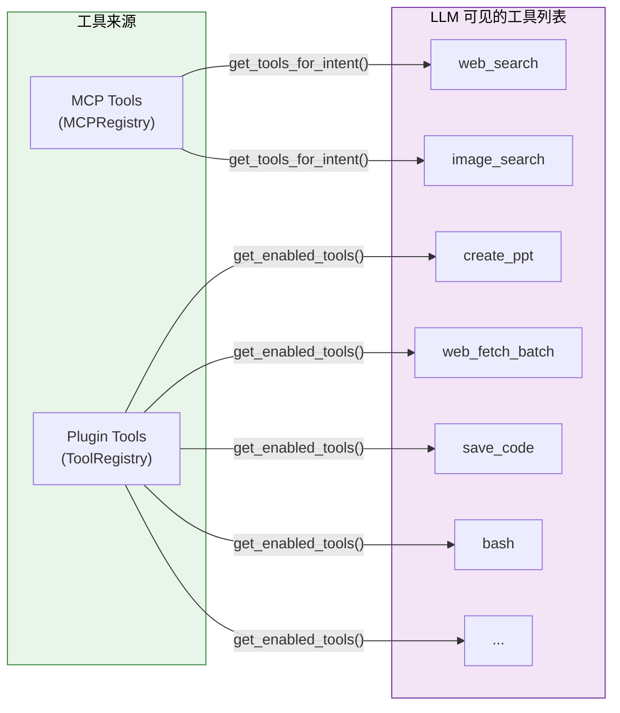

**执行优先级**: MCP 优先 → Plugin fallback

```
Orchestrator._execute_tool_call(name, args):
  1. 尝试 MCPRegistry.call_tool(name, args)
  2. MCP 失败 → ToolRegistry.call_tool(name, args)
  3. 都失败 → 记录错误到上下文
```

### 7.6 现有工具清单

| 工具名 | 类别 | 来源 | 说明 |
|--------|------|------|------|
| `web_search` | web | Plugin + MCP | 网页搜索 (SearXNG) |
| `web_fetch_batch` | web | Plugin | 批量抓取 URL 内容 |
| `image_search` | image | Plugin + MCP | 图片搜索 (Pexels/Unsplash) |
| `image_download` | image | Plugin | 图片下载到本地 |
| `create_ppt` | ppt | Plugin | PPT 生成 (python-pptx) |
| `save_code` | code | Plugin | 保存代码文件 |
| `run_code` | code | Plugin | 执行 Python 代码 |
| `bash` | shell | Plugin | 执行 Shell 命令 |
| `ls` | shell | Plugin | 列出目录内容 |
| `grep` | shell | Plugin | 文件内容搜索 |
| `read_file` | shell | Plugin | 读取文件内容 |
| `write_file` | shell | Plugin | 写入文件 |
| `delete_file` | shell | Plugin | 删除文件/目录 |

### 7.7 新增工具示例

在 `plugins/` 目录下新建文件即可，无需修改任何注册代码：

```python
# plugins/my_custom_tool.py
from modules.agents.tool_base import BaseTool

class MyCustomTool(BaseTool):
    name = "my_tool"
    description = "描述你的工具功能"
    category = "custom"
    parameters = {
        "type": "object",
        "properties": {
            "input": {"type": "string", "description": "输入参数"}
        },
        "required": ["input"]
    }

    def execute(self, input: str = "", **kwargs):
        # 工具逻辑
        return f"Result for: {input}"
```

重启服务后自动注册。

---

## 8. 数据模型与状态管理

### 8.1 AgentState 状态机

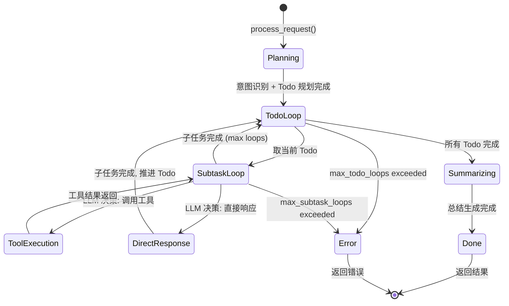

### 8.2 AgentState 关键字段

| 字段 | 类型 | 说明 |
|------|------|------|
| `user_request` | str | 用户原始请求 |
| `intent_type` | str | 意图类型: ppt / research / coding |
| `request_id` | str | 请求唯一标识 |
| `todo_list` | List[str] | 任务清单 |
| `current_todo_idx` | int | 当前执行到的 Todo 索引 |
| `todos_completed` | List[Dict] | 已完成的 Todo 及结果 |
| `current_subtask` | str | 当前正在执行的子任务 |
| `subtask_status` | str | idle / running / completed / failed |
| `subtask_history` | List[Dict] | 子任务执行历史 |
| `subtask_loop_count` | int | 当前子任务循环次数 |
| `collected_data` | List[str] | 收集的数据 |
| `generated_files` | List[str] | 生成的文件路径 |
| `final_result` | str | 最终结果 |
| `orchestrator_phase` | str | planning / todo_loop / subtask_loop / summarizing / done |
| `loop_level` | str | simple / complex |

---

## 9. 配置管理设计

### 9.1 配置架构

`ConfigManager` 采用**单例模式** + **线程安全**，读写 `Helix.json` 配置文件。

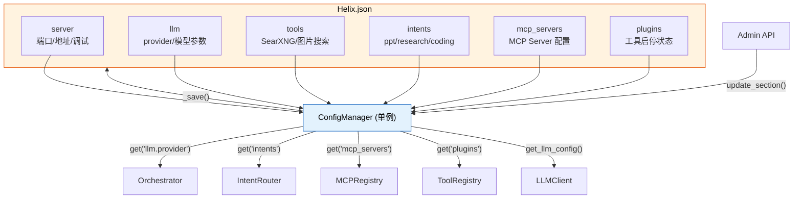

### 9.2 配置热更新

| 配置变更 | 影响 | 热更新方式 |
|----------|------|------------|
| LLM 参数 | LLMClient | `orchestrator.refresh_llm()` |
| MCP Server | MCPRegistry | `mcp_registry.reload()` |
| 工具启停 | ToolRegistry | `tool_registry.save_enabled_state()` |
| 意图配置 | IntentRouter | 实时读取，无需刷新 |

---

## 10. 部署与运维

### 10.1 服务架构

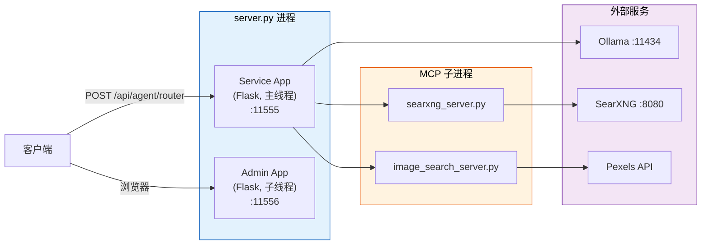

### 10.2 日志系统

| 日志类型 | 颜色 | 函数 | 用途 |
|----------|------|------|------|
| Agent → LLM | 蓝色 | `log_agent_to_llm()` | 发送给 LLM 的请求 |
| LLM → Agent | 绿色 | `log_llm_to_agent()` | LLM 返回的响应 |
| Tool 调用 | 青色 | `log_tool_call()` | 工具执行记录 |
| Orchestrator | 黄色 | `log_orchestrator()` | 编排器状态变更 |
| 错误 | 红色 | `log_error()` | 异常信息 |
| 信息 | 白色 | `log_info()` | 一般信息 |

日志同时输出到控制台和 `debugout.log` 文件，Admin UI 提供 Web 日志查看器。

---

> **文档维护**: 本文档随代码迭代同步更新。架构图和时序图使用 Mermaid 语法，可在支持 Mermaid 的 Markdown 渲染器中直接查看。
