# Helix AI Agent - 系统设计文档

> **版本**: 1.3  
> **最后更新**: 2026-07-31  
> **项目代号**: Helix  
> **技术栈**: Python 3.12+ / Flask / python-pptx / ai_engine / MCP Protocol

---

## 目录

1. [系统概述](#1-系统概述)
2. [架构层设计](#2-架构层设计)
3. [主流程时序图](#3-主流程时序图)
4. [DAG节点循环设计](#4-dag节点循环设计)
5. [节点执行编排详解](#5-节点执行编排详解)
6. [MCP支持设计](#6-mcp支持设计)
7. [Tool插件化设计](#7-tool插件化设计)
8. [数据模型与状态管理](#8-数据模型与状态管理)
9. [配置管理设计](#9-配置管理设计)
10. [部署与运维](#10-部署与运维)

---

## 1. 系统概述

Helix 是一个混合驱动的 AI Agent 服务，核心理念是**LLM 负责决策，工具负责执行**。系统采用三阶段 DAG 架构（Three-Phase DAG Architecture）：Phase 1 由 LLM 将请求分解为带依赖关系的 DAG 节点图，Phase 2 按依赖顺序执行各节点（无依赖节点可并行），Phase 3 汇总节点结果生成最终答案。同时支持 MCP（Model Context Protocol）协议实现外部工具的标准化接入。

### 1.1 核心设计原则

| 原则 | 说明 |
|------|------|
| **LLM 驱动决策** | LLM 是系统的"大脑"，负责任务分解、工具选择、节点完成判定、结果总结 |
| **三阶段 DAG 编排** | Phase 1 任务规划（生成节点图）→ Phase 2 节点循环（依赖解析 + 并行执行）→ Phase 3 总结（可选） |
| **动态任务图** | 执行中 LLM 可更新节点图（`need_update_node`），失败节点自动标记 FAILED 并跳过其下游 |
| **插件化工具** | 所有工具通过 BaseTool 抽象 + ToolRegistry 自动发现 |
| **MCP 标准化** | 外部工具通过 MCP 协议接入，支持 stdio 和 SSE 两种传输模式 |
| **多模型支持** | 通过 [ai_engine](../ai_engine/) 子模块统一接入，支持 Ollama / OpenAI / Anthropic / Gemini / DeepSeek / Groq / Together / Mistral 等 10+ Provider |

---

## 2. 架构层设计

系统采用六层架构，各层职责清晰、依赖方向单一向下。

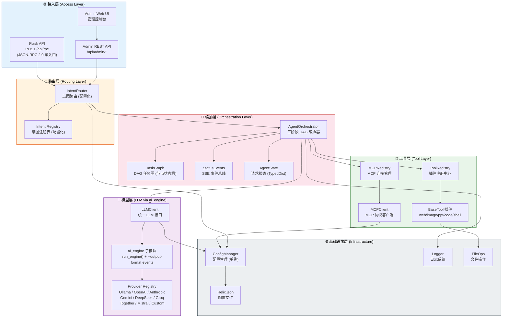
```mermaid
graph TB
    subgraph L1["🌐 接入层 (Access Layer)"]
        A1["Flask API<br/>POST /api/rpc<br/>(JSON-RPC 2.0 单入口)"]
        A2["Admin Web UI<br/>管理控制台"]
        A3["Admin REST API<br/>/api/admin/*"]
    end

    subgraph L2["🧭 路由层 (Routing Layer)"]
        B1["IntentRouter<br/>意图路由 (配置化)"]
        B2["Intent Registry<br/>意图注册表 (配置化)"]
    end

    subgraph L3["🔄 编排层 (Orchestration Layer)"]
        C1["AgentOrchestrator<br/>三阶段 DAG 编排器"]
        C2["TaskGraph<br/>DAG 任务图 (节点状态机)"]
        C3["StatusEvents<br/>SSE 事件总线"]
        C4["AgentState<br/>请求状态 (TypedDict)"]
    end

    subgraph L4["🔧 工具层 (Tool Layer)"]
        D1["ToolRegistry<br/>插件注册中心"]
        D2["BaseTool 插件<br/>web/image/ppt/code/shell"]
        D3["MCPRegistry<br/>MCP 连接管理"]
        D4["MCPClient<br/>MCP 协议客户端"]
    end

    subgraph L5["🧠 模型层 (LLM via ai_engine)"]
        E1["LLMClient<br/>统一 LLM 接口"]
        E2["ai_engine 子模块<br/>run_engine() + --output-format events"]
        E3["Provider Registry<br/>Ollama / OpenAI / Anthropic<br/>Gemini / DeepSeek / Groq<br/>Together / Mistral / Custom"]
    end

    subgraph L6["⚙️ 基础设施层 (Infrastructure)"]
        F1["ConfigManager<br/>配置管理 (单例)"]
        F2["Logger<br/>日志系统"]
        F3["FileOps<br/>文件操作"]
        F4["Helix.json<br/>配置文件"]
    end

    A1 --> B1
    A2 --> A3
    A3 --> B1
    B1 --> B2
    B1 --> C1
    C1 --> C2
    C1 --> C3
    C1 --> C4
    C1 --> D1
    C1 --> D3
    D1 --> D2
    D3 --> D4
    C1 --> E1
    E1 --> E2
    E2 --> E3
    D2 --> F3
    D4 --> F1
    E1 --> F1
    B1 --> F1
    C1 --> F2
    F1 --> F4

    style L1 fill:#e3f2fd,stroke:#1565c0,color:#000
    style L2 fill:#fff3e0,stroke:#e65100,color:#000
    style L3 fill:#fce4ec,stroke:#c62828,color:#000
    style L4 fill:#e8f5e9,stroke:#2e7d32,color:#000
    style L5 fill:#f3e5f5,stroke:#6a1b9a,color:#000
    style L6 fill:#eceff1,stroke:#37474f,color:#000
```

### 2.1 各层职责

| 层级 | 模块 | 职责 |
|------|------|------|
| **接入层** | `Helix.py`, `routes.py` | HTTP 端点暴露、JSON-RPC 2.0 请求解析与分发、SSE 流、Admin UI |
| **路由层** | `intent_router.py` | 配置化的意图注册与启停，按请求分发到对应 orchestrator |
| **编排层** | `orchestrator.py`, `task_graph.py`, `agent_state.py`, `status_events.py` | 三阶段 DAG 编排（规划→节点循环→总结）、任务图状态机、请求状态、SSE 状态推送 |
| **工具层** | `tool_base.py`, `plugins/*`, `mcp_client.py`, `mcp_registry.py` | 插件化工具管理、MCP 协议通信 |
| **模型层** | `llm_client.py` + `ai_engine/` | 通过 ai_engine 子模块统一接入所有 LLM Provider，事件驱动输出格式，verbose 日志采集 |
| **基础设施层** | `config_manager.py`, `logger.py`, `file_ops.py` | 配置读写、日志、文件 IO |

---

## 3. 主流程时序图

描述一个完整请求从用户发起到最终响应返回的全生命周期。

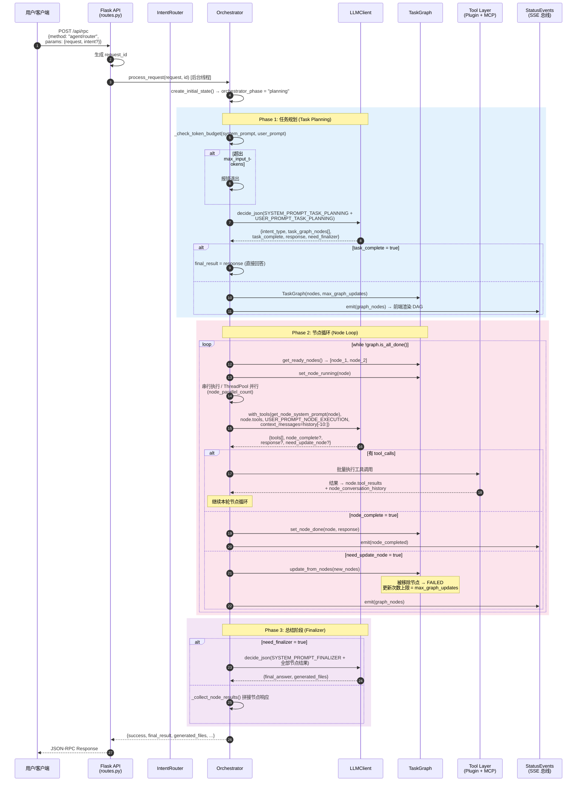
```mermaid
sequenceDiagram
    autonumber
    participant User as 用户/客户端
    participant API as Flask API<br/>(routes.py)
    participant Router as IntentRouter
    participant Orch as Orchestrator
    participant LLM as LLMClient
    participant Graph as TaskGraph
    participant Tools as Tool Layer<br/>(Plugin + MCP)
    participant SSE as StatusEvents<br/>(SSE 总线)

    User->>API: POST /api/rpc<br/>{method: "agent/router",<br/>params: {request, intent?}}
    API->>API: 生成 request_id
    API->>Orch: process_request(request, id) [后台线程]
    Orch->>Orch: create_initial_state() → orchestrator_phase = "planning"

    rect rgb(227, 242, 253)
        Note over Orch,LLM: Phase 1: 任务规划 (Task Planning)
        Orch->>Orch: _check_token_budget(system_prompt, user_prompt)
        alt 超出 max_input_tokens
            Orch->>Orch: 报错退出
        end
        Orch->>LLM: decide_json(SYSTEM_PROMPT_TASK_PLANNING +<br/>USER_PROMPT_TASK_PLANNING)
        LLM-->>Orch: {intent_type, task_graph_nodes[],<br/>task_complete, response, need_finalizer}

        alt task_complete = true
            Orch->>Orch: final_result = response (直接回答)
        else
            Orch->>Graph: TaskGraph(nodes, max_graph_updates)
            Orch->>SSE: emit(graph_nodes) → 前端渲染 DAG
        end
    end

    rect rgb(252, 228, 236)
        Note over Orch,Graph: Phase 2: 节点循环 (Node Loop)
        loop while !graph.is_all_done()
            Orch->>Graph: get_ready_nodes() → [node_1, node_2]
            Orch->>Graph: set_node_running(node)
            Orch->>Orch: 串行执行 / ThreadPool 并行<br/>(node_parallel_count)

            Orch->>LLM: with_tools(get_node_system_prompt(node),<br/>node.tools, USER_PROMPT_NODE_EXECUTION,<br/>context_messages=history[-10:])
            LLM-->>Orch: {tools[], node_complete?,<br/>response?, need_update_node?}

            alt 有 tool_calls
                Orch->>Tools: 批量执行工具调用
                Tools-->>Orch: 结果 → node.tool_results<br/>+ node_conversation_history
                Note over Orch: 继续本轮节点循环
            else node_complete = true
                Orch->>Graph: set_node_done(node, response)
                Orch->>SSE: emit(node_completed)
            else need_update_node = true
                Orch->>Graph: update_from_nodes(new_nodes)
                Note over Graph: 被移除节点 → FAILED<br/>更新次数上限 = max_graph_updates
                Orch->>SSE: emit(graph_nodes)
            end
        end
    end

    rect rgb(243, 229, 245)
        Note over Orch,LLM: Phase 3: 总结阶段 (Finalizer)
        alt need_finalizer = true
            Orch->>LLM: decide_json(SYSTEM_PROMPT_FINALIZER +<br/>全部节点结果)
            LLM-->>Orch: {final_answer, generated_files}
        else
            Orch->>Orch: _collect_node_results() 拼接节点响应
        end
    end

    Orch-->>API: {success, final_result, generated_files, ...}
    API-->>User: JSON-RPC Response
```

---

## 4. DAG节点循环设计

节点循环（Phase 2）是编排核心：从任务图中持续取 `Ready` 状态的节点执行，直到全部 `Done`。v4.0 重构后，任务以 DAG 节点图形式组织，节点间通过 `depends` 声明依赖，无依赖节点可并行执行。

### 4.1 节点状态机

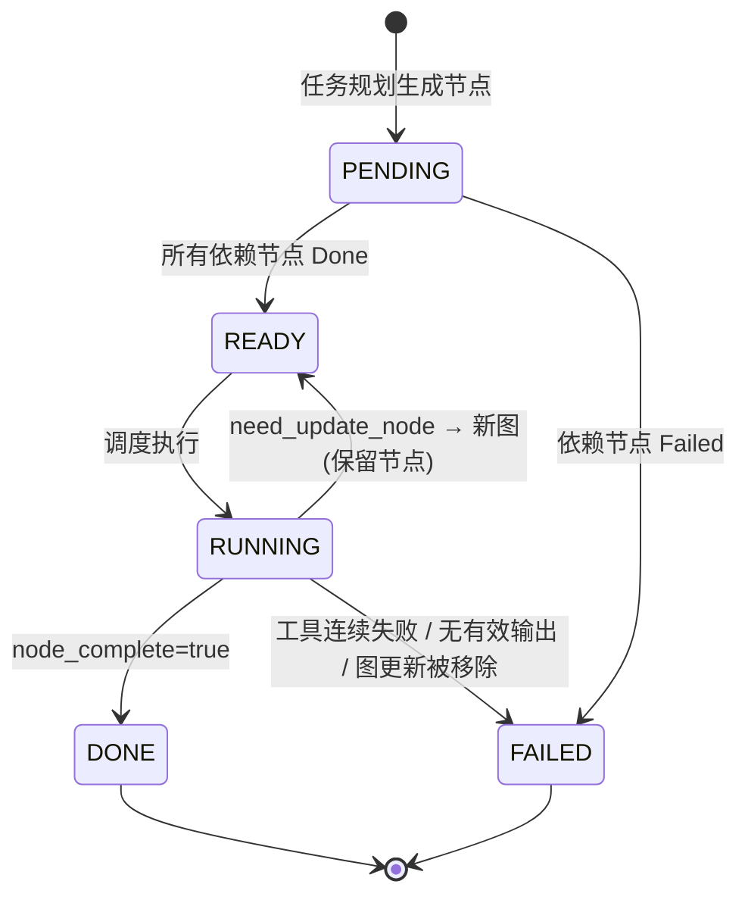
```mermaid
stateDiagram-v2
    [*] --> PENDING: 任务规划生成节点
    PENDING --> READY: 所有依赖节点 Done
    PENDING --> FAILED: 依赖节点 Failed
    READY --> RUNNING: 调度执行
    RUNNING --> DONE: node_complete=true
    RUNNING --> FAILED: 工具连续失败 / 无有效输出 / 图更新被移除
    RUNNING --> READY: need_update_node → 新图 (保留节点)
    DONE --> [*]
    FAILED --> [*]
```

| 状态 | 说明 |
|------|------|
| **PENDING** | 节点已创建，等待依赖就绪 |
| **READY** | 所有 `depends` 节点已完成，可调度执行 |
| **RUNNING** | 正在执行（串行主线程或并行子线程） |
| **DONE** | 执行完成，产出 `response` |
| **FAILED** | 执行失败（工具失败/无输出/超限/被图更新移除），下游节点自动 FAILED |

### 4.2 节点循环时序

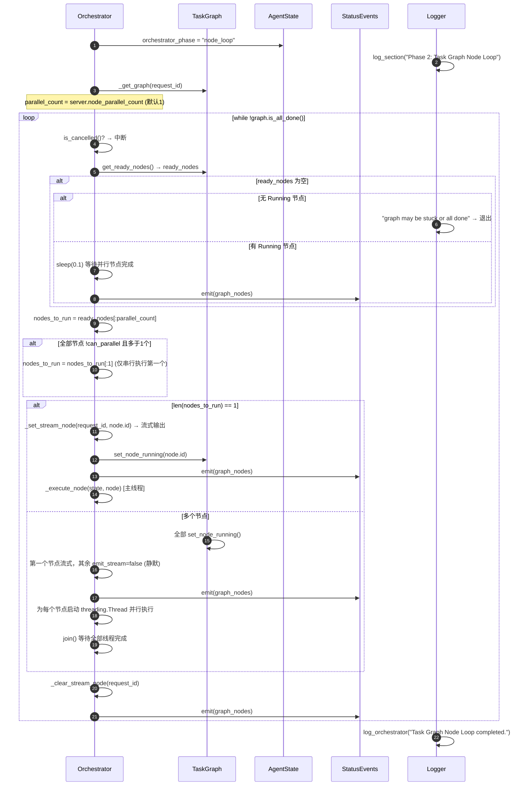
```mermaid
sequenceDiagram
    autonumber
    participant Orch as Orchestrator
    participant Graph as TaskGraph
    participant State as AgentState
    participant SSE as StatusEvents
    participant Log as Logger

    Orch->>State: orchestrator_phase = "node_loop"
    Log->>Log: log_section("Phase 2: Task Graph Node Loop")
    Orch->>Graph: _get_graph(request_id)
    Note over Orch: parallel_count = server.node_parallel_count (默认1)

    loop while !graph.is_all_done()
        Orch->>Orch: is_cancelled()? → 中断

        Orch->>Graph: get_ready_nodes() → ready_nodes
        alt ready_nodes 为空
            alt 无 Running 节点
                Log->>Log: "graph may be stuck or all done" → 退出
            else 有 Running 节点
                Orch->>Orch: sleep(0.1) 等待并行节点完成
                Orch->>SSE: emit(graph_nodes)
            end
        end

        Orch->>Orch: nodes_to_run = ready_nodes[:parallel_count]
        alt 全部节点 !can_parallel 且多于1个
            Orch->>Orch: nodes_to_run = nodes_to_run[:1] (仅串行执行第一个)
        end

        alt len(nodes_to_run) == 1
            Orch->>Orch: _set_stream_node(request_id, node.id) → 流式输出
            Orch->>Graph: set_node_running(node.id)
            Orch->>SSE: emit(graph_nodes)
            Orch->>Orch: _execute_node(state, node) [主线程]
        else 多个节点
            Graph->>Graph: 全部 set_node_running()
            Orch->>Orch: 第一个节点流式，其余 emit_stream=false (静默)
            Orch->>SSE: emit(graph_nodes)
            Orch->>Orch: 为每个节点启动 threading.Thread 并行执行
            Orch->>Orch: join() 等待全部线程完成
        end

        Orch->>Orch: _clear_stream_node(request_id)
        Orch->>SSE: emit(graph_nodes)
    end

    Log->>Log: log_orchestrator("Task Graph Node Loop completed.")
```

### 4.3 节点循环关键机制

| 机制 | 说明 |
|------|------|
| **就绪判断** | `get_ready_nodes()` 返回所有 `depends` 均已完成、状态为 READY 的节点 |
| **并行控制** | `server.node_parallel_count` 决定单批最多并行节点数（默认1=串行）；`can_parallel=false` 的节点永不与其他节点并行 |
| **流式输出** | 单节点或并行批次第一个节点流式输出，其余并行节点静默执行、完成后 emit `node_completed` 事件 |
| **卡死防护** | 无 Ready 且无 Running 节点时判定图停滞并退出；有 Running 时 0.1s 轮询等待 |
| **取消支持** | 每轮循环检查 `is_cancelled()`，用户取消立即中断 |
| **状态可视化** | 每轮节点状态变更均通过 `status_events.emit(graph_nodes=...)` 推送，前端实时渲染 DAG |

---

## 5. 节点执行编排详解

v4.0 重构后，节点内部采用 **LLM 决策 → 工具执行 → 循环** 的 tool-calling 模式，直到 LLM 声明节点完成或需要更新任务图：

- **Phase 1 (Task Planning)**: LLM 将用户请求分解为带依赖的 DAG 节点图
- **Phase 2 (Node Loop)**: 按依赖顺序调度执行各节点，每个节点内部是一个独立的工具调用循环
- **Phase 3 (Finalizer)**: 将所有节点结果汇总为最终答案

### 5.1 节点执行流程

```mermaid
sequenceDiagram
    autonumber
    participant Orch as Orchestrator
    participant Graph as TaskGraph
    participant LLM as LLMClient
    participant TR as ToolRegistry<br/>(Plugin Tools)
    participant MCP as MCPRegistry<br/>(MCP Tools)
    participant Node as TaskNode

    Note over Orch: ──── _execute_node(state, node) ────
    Orch->>Orch: tool_definitions = _build_tool_definitions()
    Orch->>Orch: system_prompt = get_node_system_prompt(intent_type)
    Orch->>Node: node_conversation_history = []

    loop while True (iteration 1, 2, ...)
        Orch->>Orch: is_cancelled()? → break
        Orch->>Graph: get_graph_state_string(node.id)
        Orch->>Orch: conv = _format_node_conversation(node)
        Orch->>Orch: tool_results_str = _format_tool_results(node)

        alt !_check_token_budget(...)
            Orch->>Graph: set_node_failed("prompt exceeds max_input_tokens")
            break
        end

        Orch->>Orch: user_prompt = USER_PROMPT_NODE_EXECUTION.format(<br/>node_id, node_title, node_tools,<br/>tool_results, conversation_history, graph_state)
        Orch->>LLM: with_tools(prompt, tool_definitions,<br/>system_prompt, emit_stream)
        LLM-->>Orch: llm_response (content + tool_calls?)
        Orch->>Node: node_conversation_history.append(assistant)

        alt 原生 tool_calls (OpenAI 格式)
            loop 遍历每个 tool_call
                Orch->>Orch: _execute_tool_call(state, tc)
                Orch->>MCP: call_tool(name, args) [优先]
                Orch->>TR: call_tool(name, args) [fallback]
                Orch->>Node: tool_results.append({tool, args, result[:1000]})
            end
            Note over Orch: continue → 下一轮循环
        else JSON 协议 tools[]
            loop 遍历每个 tool
                Orch->>Orch: _execute_tool_call(state, tc)
                Orch->>Node: tool_results.append({tool, args, result[:1000]})
            end
            Note over Orch: continue → 下一轮循环
        else node_complete = true
            Orch->>Graph: set_node_done(node.id, response)
            alt !emit_stream
                Orch->>Orch: emit node_completed 事件<br/>(node_id, node_title, response[:200])
            end
            break
        else need_update_node = true
            alt 有 task_graph_nodes[] 且未达 max_graph_updates
                Orch->>Graph: update_from_nodes(new_nodes)
                Note over Graph: 消失的节点 → FAILED
                alt 当前节点被移除或已 FAILED
                    Orch->>Graph: set_node_failed("Node removed during graph update")
                end
                break
            else 无节点
                Orch->>Graph: set_node_failed("Graph update with no nodes")
            else 已达上限
                Orch->>Graph: set_node_failed("Max graph updates reached")
            end
            break
        else 无 tools / complete / update
            Orch->>Graph: set_node_failed("No tool calls or completion from LLM")
            break
        end
    end
```

### 5.2 节点执行关键机制

| 机制 | 说明 |
|------|------|
| **节点级上下文隔离** | 每个 `TaskNode` 持有独立的 `node_conversation_history` 与 `tool_results`，节点间互不污染 |
| **工具定义注入** | 每轮循环将全部可用工具（Plugin + MCP）统一为 `ToolDefinition[]` 提供给 LLM |
| **双协议工具调用** | 兼容 OpenAI 原生 `tool_calls` 与 JSON 协议 `tools[]`，均批量执行并记录结果（截断至1000字符） |
| **Token 预算检查** | 每轮循环前检查图状态 + 会话历史 + 工具结果总长度，超限则节点标记 FAILED |
| **动态图更新** | `need_update_node=true` 时用新节点列表调用 `update_from_nodes()`，受 `llm.max_graph_updates` 限制；被移除节点标记 FAILED 并终止执行 |
| **完成判定** | 仅当 LLM 返回 `node_complete=true` 时节点置 DONE；连续无有效输出则 FAILED |
| **静默节点通知** | 非流式并行节点完成时通过 `node_completed` 事件通知前端，保持 DAG 状态实时同步 |

### 5.3 Finalizer 总结阶段

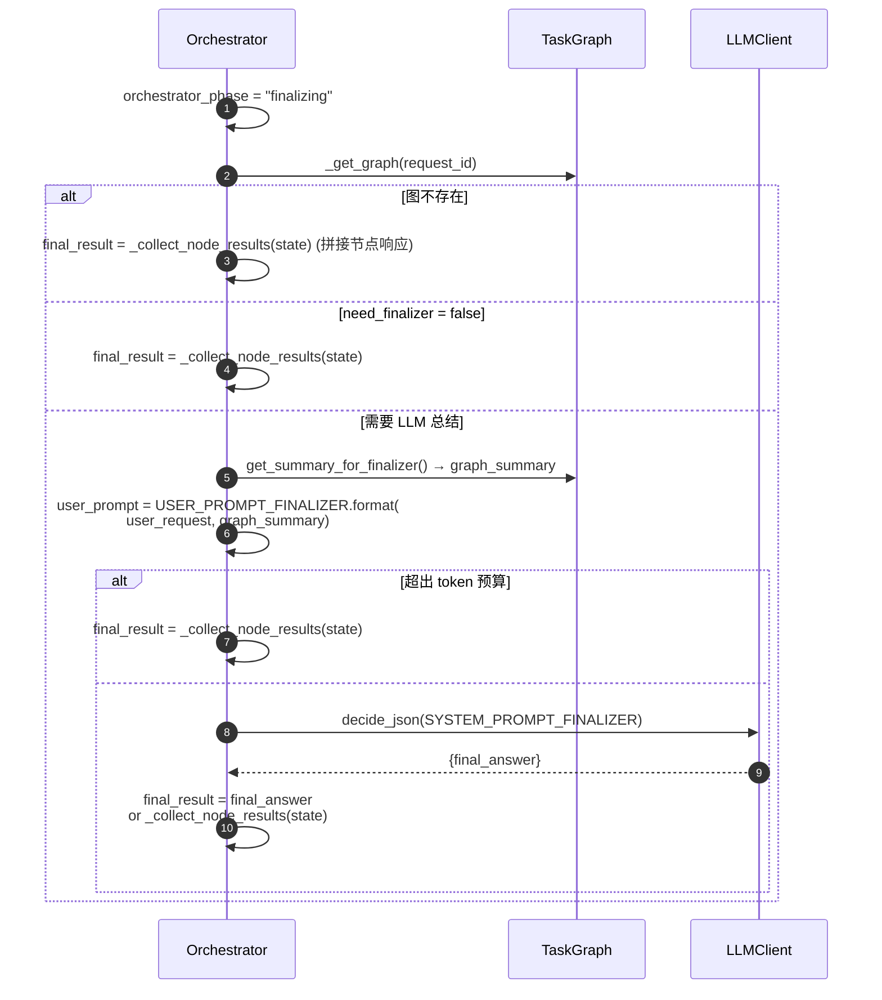
```mermaid
sequenceDiagram
    autonumber
    participant Orch as Orchestrator
    participant Graph as TaskGraph
    participant LLM as LLMClient

    Orch->>Orch: orchestrator_phase = "finalizing"
    Orch->>Graph: _get_graph(request_id)

    alt 图不存在
        Orch->>Orch: final_result = _collect_node_results(state) (拼接节点响应)
    else need_finalizer = false
        Orch->>Orch: final_result = _collect_node_results(state)
    else 需要 LLM 总结
        Orch->>Graph: get_summary_for_finalizer() → graph_summary
        Orch->>Orch: user_prompt = USER_PROMPT_FINALIZER.format(<br/>user_request, graph_summary)

        alt 超出 token 预算
            Orch->>Orch: final_result = _collect_node_results(state)
        else
            Orch->>LLM: decide_json(SYSTEM_PROMPT_FINALIZER)
            LLM-->>Orch: {final_answer}
            Orch->>Orch: final_result = final_answer<br/>or _collect_node_results(state)
        end
    end
```

---

## 6. MCP支持设计

MCP（Model Context Protocol）是一种标准化的工具接入协议，Helix 实现了完整的 MCP 客户端，支持 **stdio** 和 **SSE** 两种传输模式。

### 6.1 MCP 整体架构

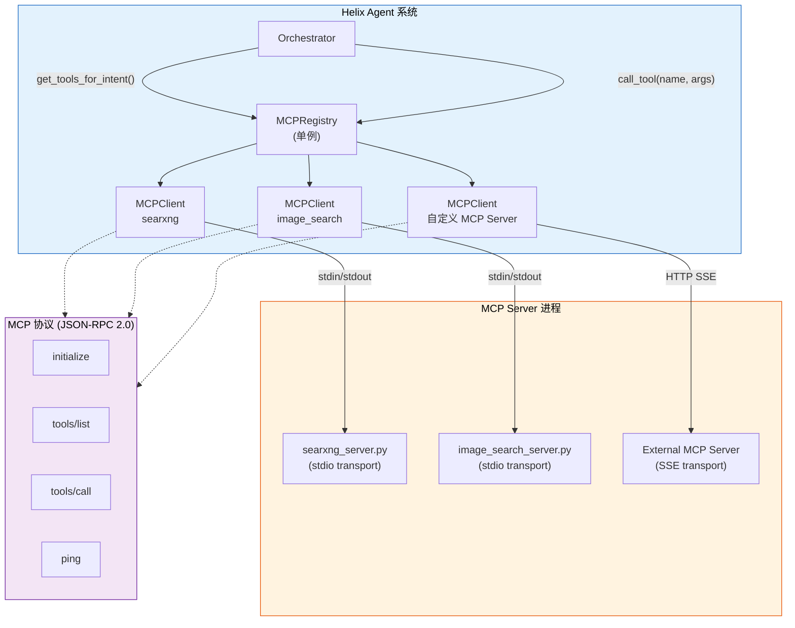
```mermaid
graph TB
    subgraph Helix["Helix Agent 系统"]
        ORCH["Orchestrator"]
        MCPREG["MCPRegistry<br/>(单例)"]
        CLIENT1["MCPClient<br/>searxng"]
        CLIENT2["MCPClient<br/>image_search"]
        CLIENT3["MCPClient<br/>自定义 MCP Server"]
    end

    subgraph MCP_Servers["MCP Server 进程"]
        S1["searxng_server.py<br/>(stdio transport)"]
        S2["image_search_server.py<br/>(stdio transport)"]
        S3["External MCP Server<br/>(SSE transport)"]
    end

    subgraph Protocol["MCP 协议 (JSON-RPC 2.0)"]
        P1["initialize"]
        P2["tools/list"]
        P3["tools/call"]
        P4["ping"]
    end

    ORCH -->|"get_tools_for_intent()"| MCPREG
    ORCH -->|"call_tool(name, args)"| MCPREG
    MCPREG --> CLIENT1
    MCPREG --> CLIENT2
    MCPREG --> CLIENT3
    CLIENT1 -->|"stdin/stdout"| S1
    CLIENT2 -->|"stdin/stdout"| S2
    CLIENT3 -->|"HTTP SSE"| S3
    CLIENT1 -.-> Protocol
    CLIENT2 -.-> Protocol
    CLIENT3 -.-> Protocol

    style Helix fill:#e3f2fd,stroke:#1565c0,color:#000
    style MCP_Servers fill:#fff3e0,stroke:#e65100,color:#000
    style Protocol fill:#f3e5f5,stroke:#6a1b9a,color:#000
```

### 6.2 MCP 连接生命周期

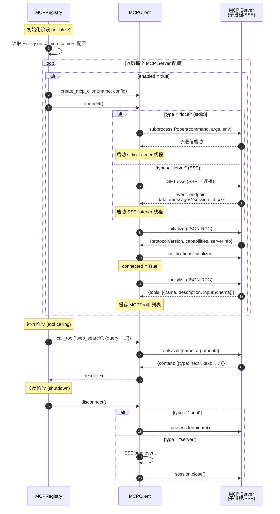
```mermaid
sequenceDiagram
    autonumber
    participant Reg as MCPRegistry
    participant Client as MCPClient
    participant Server as MCP Server<br/>(子进程/SSE)

    Note over Reg: 初始化阶段 (initialize)
    Reg->>Reg: 读取 Helix.json → mcp_servers 配置
    loop 遍历每个 MCP Server 配置
        alt enabled = true
            Reg->>Client: create_mcp_client(name, config)
            Reg->>Client: connect()

            alt type = "local" (stdio)
                Client->>Server: subprocess.Popen(command, args, env)
                Server-->>Client: 子进程启动
                Note over Client: 启动 stdio_reader 线程
            else type = "server" (SSE)
                Client->>Server: GET /sse (SSE 长连接)
                Server-->>Client: event: endpoint<br/>data: /messages?session_id=xxx
                Note over Client: 启动 SSE listener 线程
            end

            Client->>Server: initialize (JSON-RPC)
            Server-->>Client: {protocolVersion, capabilities, serverInfo}
            Client->>Server: notifications/initialized
            Note over Client: connected = True

            Client->>Server: tools/list (JSON-RPC)
            Server-->>Client: {tools: [{name, description, inputSchema}]}
            Note over Client: 缓存 MCPTool[] 列表
        end
    end

    Note over Reg: 运行阶段 (tool calling)
    Reg->>Client: call_tool("web_search", {query: "..."})
    Client->>Server: tools/call {name, arguments}
    Server-->>Client: {content: [{type: "text", text: "..."}]}
    Client-->>Reg: result text

    Note over Reg: 关闭阶段 (shutdown)
    Reg->>Client: disconnect()
    alt type = "local"
        Client->>Server: process.terminate()
    else type = "server"
        Client->>Client: SSE stop event
        Client->>Server: session.close()
    end
```

### 6.3 MCP 传输模式对比

| 特性 | stdio (local) | SSE (server) |
|------|---------------|--------------|
| **传输方式** | 子进程 stdin/stdout | HTTP SSE + POST |
| **适用场景** | 内置 MCP Server（同机部署） | 外部 MCP Server（远程部署） |
| **进程管理** | Helix 管理子进程生命周期 | 外部独立进程 |
| **通信线程** | stdio_reader 后台线程 | SSE listener 后台线程 |
| **配置方式** | `command` + `args` + `env` | `url` |
| **环境变量** | 通过 `env` 字段注入 | 由外部 Server 自行管理 |

### 6.4 MCP 意图路由

MCPRegistry 通过 `intent_categories` 实现基于意图的工具过滤：

```
MCP Server 配置:
  searxng:
    intent_categories: ["ppt", "research"]
  image_search:
    intent_categories: ["ppt", "research"]

调用时:
  get_tools_for_intent("ppt")     → [web_search, image_search]
  get_tools_for_intent("coding")  → []  (无匹配的 MCP 工具)
  get_tools_for_intent("research") → [web_search, image_search]
```

### 6.5 MCP 协议实现

Helix 实现了 MCP 协议版本 `2024-11-05`，支持以下 JSON-RPC 方法：

| 方法 | 方向 | 说明 |
|------|------|------|
| `initialize` | Client → Server | 握手，交换协议版本和能力 |
| `notifications/initialized` | Client → Server | 初始化完成通知（无响应） |
| `tools/list` | Client → Server | 发现 Server 暴露的工具 |
| `tools/call` | Client → Server | 调用指定工具 |
| `ping` | Client → Server | 心跳检测 |

### 6.6 内置 MCP Server

| Server | 文件 | 工具 | 后端 |
|--------|------|------|------|
| **SearXNG** | `mcp/searxng_server.py` | `web_search` | SearXNG 搜索引擎 API |
| **Image Search** | `mcp/image_search_server.py` | `image_search` | Pexels / Unsplash API |

---

## 7. Tool插件化设计

Helix 的工具系统采用**抽象基类 + 自动发现 + 注册中心**的插件化架构，新增工具只需在 `plugins/` 目录下添加一个 Python 文件。

### 7.1 插件化架构总览


```mermaid
graph TB
    subgraph PluginDir["plugins/ 目录 (自动扫描)"]
        WT["web_tools.py<br/>WebSearchTool<br/>WebFetchBatchTool"]
        IT["image_tools.py<br/>ImageSearchTool<br/>ImageDownloadTool"]
        PT["ppt_tools.py<br/>CreatePPTTool"]
        CT["code_tools.py<br/>SaveCodeTool<br/>RunCodeTool"]
        ST["shell_tools.py<br/>BashTool, ListFilesTool<br/>GrepTool, ReadFileTool<br/>WriteFileTool, DeleteFileTool"]
    end

    subgraph Core["核心框架"]
        BT["BaseTool (ABC)<br/>name, description<br/>category, parameters<br/>execute(**kwargs)"]
        TR["ToolRegistry (单例)<br/>register / unregister<br/>call_tool / get<br/>discover_plugins<br/>enable / disable"]
    end

    subgraph Consumer["消费者"]
        ORCH["Orchestrator<br/>_execute_node()"]
        ADMIN["Admin API<br/>/api/admin/plugins"]
    end

    WT -->|subclass| BT
    IT -->|subclass| BT
    PT -->|subclass| BT
    CT -->|subclass| BT
    ST -->|subclass| BT

    BT -->|注册| TR
    TR -->|"get_enabled_tools()"| ORCH
    TR -->|"get_all_as_list()"| ADMIN
    TR -->|"call_tool(name, args)"| ORCH
    TR -->|toggle / enable / disable| ADMIN

    style PluginDir fill:#e8f5e9,stroke:#2e7d32,color:#000
    style Core fill:#e3f2fd,stroke:#1565c0,color:#000
    style Consumer fill:#fff3e0,stroke:#e65100,color:#000
```

### 7.2 插件自动发现流程

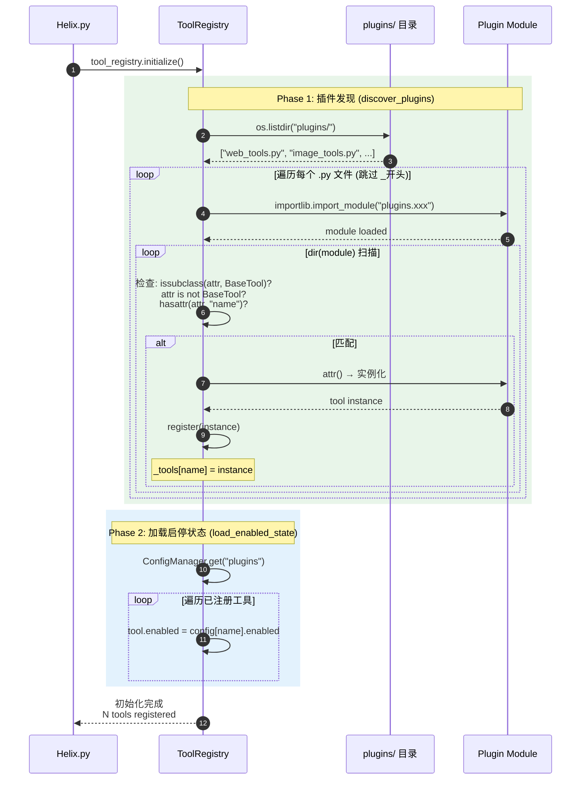
```mermaid
sequenceDiagram
    autonumber
    participant Server as Helix.py
    participant TR as ToolRegistry
    participant FS as plugins/ 目录
    participant Module as Plugin Module

    Server->>TR: tool_registry.initialize()

    rect rgb(232, 245, 233)
        Note over TR,Module: Phase 1: 插件发现 (discover_plugins)
        TR->>FS: os.listdir("plugins/")
        FS-->>TR: ["web_tools.py", "image_tools.py", ...]

        loop 遍历每个 .py 文件 (跳过 _开头)
            TR->>Module: importlib.import_module("plugins.xxx")
            Module-->>TR: module loaded

            loop dir(module) 扫描
                TR->>TR: 检查: issubclass(attr, BaseTool)?<br/>attr is not BaseTool?<br/>hasattr(attr, "name")?
                alt 匹配
                    TR->>Module: attr() → 实例化
                    Module-->>TR: tool instance
                    TR->>TR: register(instance)
                    Note over TR: _tools[name] = instance
                end
            end
        end
    end

    rect rgb(227, 242, 253)
        Note over TR: Phase 2: 加载启停状态 (load_enabled_state)
        TR->>TR: ConfigManager.get("plugins")
        loop 遍历已注册工具
            TR->>TR: tool.enabled = config[name].enabled
        end
    end

    TR-->>Server: 初始化完成<br/>N tools registered
```

### 7.3 BaseTool 抽象基类

```python
class BaseTool(ABC):
    """所有工具插件必须继承的抽象基类"""

    name: str           # 唯一标识符 (如 "web_search")
    description: str    # 人类可读描述 (给 LLM 看)
    category: str       # 分类 (web/image/ppt/code/shell)
    parameters: dict    # JSON Schema 参数定义

    @abstractmethod
    def execute(self, **kwargs) -> Any:
        """工具执行入口"""
        pass

    def to_dict(self) -> dict:
        """序列化为 API 响应格式"""

    def to_tool_definition(self) -> dict:
        """转换为 LLM ToolDefinition 格式"""
```

### 7.4 ToolRegistry 核心能力

| 能力 | 方法 | 说明 |
|------|------|------|
| **自动发现** | `discover_plugins()` | 扫描 `plugins/` 目录，导入并注册所有 BaseTool 子类 |
| **注册/注销** | `register(tool)` / `unregister(name)` | 运行时动态管理工具 |
| **查找** | `get(name)` / `get_all()` / `get_by_category(cat)` | 按名称、全部、按分类查找 |
| **启停管理** | `set_enabled(name, bool)` / `get_enabled_tools()` | 运行时启用/禁用工具 |
| **执行** | `call_tool(name, arguments)` | 按名称调用工具，支持异常处理 |
| **持久化** | `load_enabled_state()` / `save_enabled_state()` | 启停状态持久化到 Helix.json |

### 7.5 工具与 MCP 的融合策略

在子任务循环中，Plugin 工具和 MCP 工具被统一为 `ToolDefinition[]` 提供给 LLM：

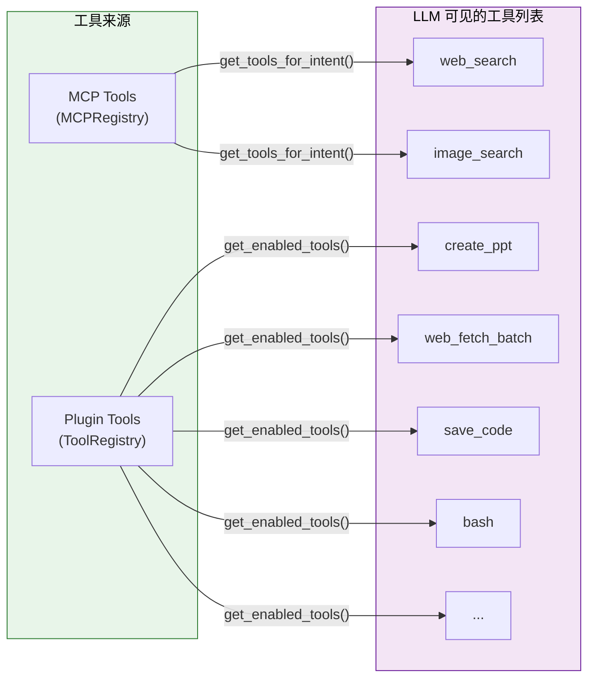
```mermaid
graph LR
    subgraph ToolDefs["LLM 可见的工具列表"]
        T1["web_search"]
        T2["image_search"]
        T3["create_ppt"]
        T4["web_fetch_batch"]
        T5["save_code"]
        T6["bash"]
        T7["..."]
    end

    subgraph Sources["工具来源"]
        P["Plugin Tools<br/>(ToolRegistry)"]
        M["MCP Tools<br/>(MCPRegistry)"]
    end

    P -->|"get_enabled_tools()"| T3
    P -->|"get_enabled_tools()"| T4
    P -->|"get_enabled_tools()"| T5
    P -->|"get_enabled_tools()"| T6
    P -->|"get_enabled_tools()"| T7
    M -->|"get_tools_for_intent()"| T1
    M -->|"get_tools_for_intent()"| T2

    style ToolDefs fill:#f3e5f5,stroke:#6a1b9a,color:#000
    style Sources fill:#e8f5e9,stroke:#2e7d32,color:#000
```

**执行优先级**: MCP 优先 → Plugin fallback

```
Orchestrator._execute_tool_call(name, args):
  1. 尝试 MCPRegistry.call_tool(name, args)
  2. MCP 失败 → ToolRegistry.call_tool(name, args)
  3. 都失败 → 记录错误到上下文
```

### 7.6 现有工具清单

| 工具名 | 类别 | 来源 | 说明 |
|--------|------|------|------|
| `web_search` | web | Plugin + MCP | 网页搜索 (SearXNG) |
| `web_fetch_batch` | web | Plugin | 批量抓取 URL 内容 |
| `image_search` | image | Plugin + MCP | 图片搜索 (Pexels/Unsplash) |
| `image_download` | image | Plugin | 图片下载到本地 |
| `create_ppt` | ppt | Plugin | PPT 生成 (python-pptx) |
| `save_code` | code | Plugin | 保存代码文件 |
| `run_code` | code | Plugin | 执行 Python 代码 |
| `bash` | shell | Plugin | 执行 Shell 命令 |
| `ls` | shell | Plugin | 列出目录内容 |
| `grep` | shell | Plugin | 文件内容搜索 |
| `read_file` | shell | Plugin | 读取文件内容 |
| `write_file` | shell | Plugin | 写入文件 |
| `delete_file` | shell | Plugin | 删除文件/目录 |

### 7.7 新增工具示例

在 `plugins/` 目录下新建文件即可，无需修改任何注册代码：

```python
# plugins/my_custom_tool.py
from modules.agents.tool_base import BaseTool

class MyCustomTool(BaseTool):
    name = "my_tool"
    description = "描述你的工具功能"
    category = "custom"
    parameters = {
        "type": "object",
        "properties": {
            "input": {"type": "string", "description": "输入参数"}
        },
        "required": ["input"]
    }

    def execute(self, input: str = "", **kwargs):
        # 工具逻辑
        return f"Result for: {input}"
```

重启服务后自动注册。

---

## 8. 数据模型与状态管理

### 8.1 编排阶段状态机

编排器的生命周期由 `AgentState.orchestrator_phase` 驱动，与三阶段 DAG 一一对应：

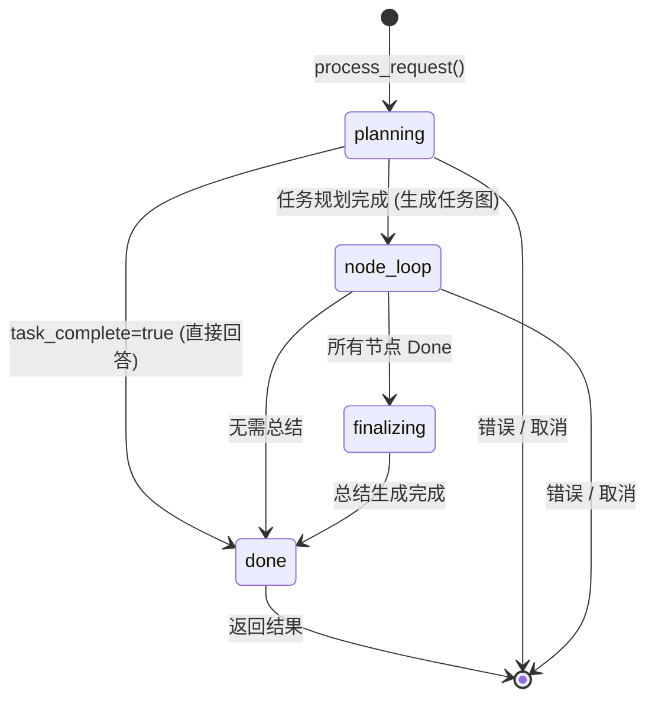
```mermaid
stateDiagram-v2
    [*] --> planning: process_request()

    planning --> node_loop: 任务规划完成 (生成任务图)
    planning --> done: task_complete=true (直接回答)

    node_loop --> finalizing: 所有节点 Done
    node_loop --> done: 无需总结

    finalizing --> done: 总结生成完成
    done --> [*]: 返回结果

    planning --> [*]: 错误 / 取消
    node_loop --> [*]: 错误 / 取消
```

| 阶段 | 值 | 说明 |
|------|------|------|
| **planning** | Phase 1 | LLM 分解请求为 DAG 节点图；`task_complete=true` 时直接回答 |
| **node_loop** | Phase 2 | 循环执行 DAG 节点，直到 `is_all_done()` |
| **finalizing** | Phase 3 | 汇总节点结果；`need_finalizer=false` 时直接拼接 |
| **done** | — | 最终结果写入 `final_result` |

### 8.2 AgentState 关键字段

`AgentState` 是 `modules/core/agent_state.py` 中定义的最小化状态 TypedDict：

| 字段 | 类型 | 说明 |
|------|------|------|
| `user_request` | str | 用户原始请求 |
| `intent_type` | str | 意图类型: ppt / research / coding |
| `request_id` | str | 请求唯一标识 |
| `forced_intent` | str | 强制指定意图（跳过规划中的意图分类） |
| `urls_to_fetch` | List[str] | 待抓取 URL（工具执行期间收集） |
| `fetched_content` | List[str] | 已抓取内容 |
| `generated_files` | List[str] | 生成的文件路径 |
| `final_result` | str | 最终结果 |
| `error` | Optional[str] | 错误信息 |
| `orchestrator_phase` | str | planning / node_loop / finalizing / done |
| `cancelled` | bool | 用户取消标记 |

### 8.3 TaskGraph 节点数据模型

任务图由 `modules/core/task_graph.py` 定义，是 Phase 2 的核心数据结构：

```python
class TaskNode:
    id: str                    # 节点唯一标识
    title: str                 # 节点任务描述
    tools: List[str]           # 建议使用的工具列表
    depends: List[str]         # 依赖的节点 id 列表
    can_parallel: bool         # 是否允许与其他节点并行
    state: NodeState           # 状态机: PENDING/READY/RUNNING/DONE/FAILED
    response: str              # 节点执行结果
    reason: str                # 完成原因
    error: str                 # 失败原因
    retry_count: int           # 重试次数
    node_conversation_history: List[Dict]  # 节点级 LLM 对话历史
    tool_results: List[Dict]   # 工具调用结果

class TaskGraph:
    nodes: Dict[str, TaskNode]       # 节点索引
    max_graph_updates: int           # 图更新次数上限 (llm.max_graph_updates)
    _graph_update_count: int         # 已更新次数
```

**核心方法**:

| 方法 | 说明 |
|------|------|
| `get_ready_nodes()` | 返回所有依赖已满足、状态为 READY 的节点 |
| `set_node_running(id)` / `set_node_done(id, response)` / `set_node_failed(id, error)` | 状态迁移 |
| `update_from_nodes(nodes)` | 动态更新任务图：新增节点、更新已有节点、移除节点（被移除节点标记 FAILED 但保留在 `_nodes` 中） |
| `has_reached_max_updates()` | 判断是否已达图更新上限 |
| `is_all_done()` | 判断所有节点是否完成（DONE/FAILED） |
| `get_summary_for_finalizer()` | 为 Finalizer 生成图摘要 |
| `to_dict_list()` | 序列化为前端 DAG 渲染格式 |

---

## 9. 配置管理设计

### 9.1 配置架构

`ConfigManager` 采用**单例模式** + **线程安全**，读写 `Helix.json` 配置文件。

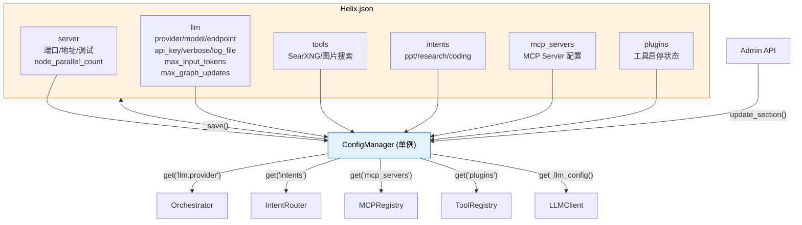
```mermaid
graph TB
    subgraph Config["Helix.json"]
        S["server<br/>端口/地址/调试<br/>node_parallel_count"]
        L["llm<br/>provider/model/endpoint<br/>api_key/verbose/log_file<br/>max_input_tokens<br/>max_graph_updates"]
        T["tools<br/>SearXNG/图片搜索"]
        I["intents<br/>ppt/research/coding"]
        M["mcp_servers<br/>MCP Server 配置"]
        P["plugins<br/>工具启停状态"]
    end

    CM["ConfigManager (单例)"]

    S --> CM
    L --> CM
    T --> CM
    I --> CM
    M --> CM
    P --> CM

    CM -->|"get('llm.provider')"| ORCH["Orchestrator"]
    CM -->|"get('intents')"| IR["IntentRouter"]
    CM -->|"get('mcp_servers')"| MR["MCPRegistry"]
    CM -->|"get('plugins')"| TR["ToolRegistry"]
    CM -->|"get_llm_config()"| LLM["LLMClient"]

    ADMIN["Admin API"] -->|"update_section()"| CM
    CM -->|"_save()"| Config

    style Config fill:#fff3e0,stroke:#e65100,color:#000
    style CM fill:#e3f2fd,stroke:#1565c0,color:#000
```

### 9.2 配置热更新

| 配置变更 | 影响 | 热更新方式 |
|----------|------|------------|
| LLM 参数 (provider/model/endpoint) | LLMClient | `orchestrator.refresh_llm()` → `LLMClient.refresh()` |
| LLM verbose / log_file | ai_engine 日志 | 下次 LLM 调用生效 |
| LLM max_input_tokens | 规划/节点执行 token 预算 | 下次调用读取，实时生效 |
| LLM max_graph_updates | 任务图更新上限 | 下次请求读取，实时生效 |
| server.node_parallel_count | 节点并行度 | 下次请求读取，实时生效 |
| MCP Server | MCPRegistry | `mcp_registry.reload()` |
| 工具启停 | ToolRegistry | `tool_registry.save_enabled_state()` |
| 意图配置 | IntentRouter | 实时读取，无需刷新 |

### 9.3 LLM 配置格式（ai_engine 集成后）

LLM 配置已从按 Provider 分组的嵌套结构统一为扁平格式，由 ai_engine 子模块处理 Provider 差异：

```json
{
  "llm": {
    "provider": "ollama_native",
    "model": "qwen2.5:7b",
    "endpoint": "http://localhost:11434",
    "api_key": "",
    "verbose": true,
    "log_file": "llm_engine.log",
    "max_input_tokens": 32768,
    "max_graph_updates": 5
  }
}
```

Web 管理控制台的 LLM 配置页面通过 `/api/admin/llm/providers` 动态获取可用 Provider 列表（调用 `ai_engine --get-provider`），用户在下拉菜单中选择即可，无需手动填写 provider key。

---

## 10. 部署与运维

### 10.1 服务架构

```mermaid
graph LR
    subgraph Process["Helix.py 进程"]
        SVC["Service App<br/>(Flask, 主线程)<br/>:11555"]
        ADM["Admin App<br/>(Flask, 子线程)<br/>:11556"]
    end

    subgraph SubProcs["MCP 子进程"]
        SP1["searxng_server.py"]
        SP2["image_search_server.py"]
    end

    subgraph External["外部服务"]
        OLL["Ollama :11434"]
        SX["SearXNG :8080"]
        PX["Pexels API"]
    end

    USER["客户端"] -->|POST /api/rpc (JSON-RPC)| SVC
    USER -->|浏览器| ADM
    SVC --> SP1
    SVC --> SP2
    SVC --> OLL
    SP1 --> SX
    SP2 --> PX

    style Process fill:#e3f2fd,stroke:#1565c0,color:#000
    style SubProcs fill:#fff3e0,stroke:#e65100,color:#000
    style External fill:#f3e5f5,stroke:#6a1b9a,color:#000
```

### 10.2 日志系统

系统中存在三条独立的日志通路，各自服务于不同的目的和查看场景：

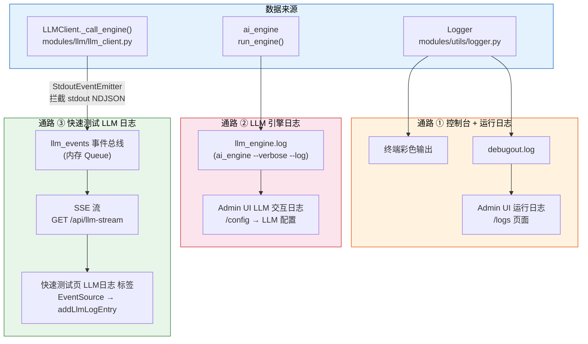
```mermaid
graph TB
    subgraph Source["数据来源"]
        Logger["Logger<br/>modules/utils/logger.py"]
        AIEngine["ai_engine<br/>run_engine()"]
        LLMClient["LLMClient._call_engine()<br/>modules/llm/llm_client.py"]
    end

    subgraph Sink1["通路 ① 控制台 + 运行日志"]
        Console["终端彩色输出"]
        DebugLog["debugout.log"]
        RunLogUI["Admin UI 运行日志<br/>/logs 页面"]
    end

    subgraph Sink2["通路 ② LLM 引擎日志"]
        EngineLog["llm_engine.log<br/>(ai_engine --verbose --log)"]
        LlmLogUI["Admin UI LLM 交互日志<br/>/config → LLM 配置"]
    end

    subgraph Sink3["通路 ③ 快速测试 LLM 日志"]
        EventBus["llm_events 事件总线<br/>(内存 Queue)"]
        SSE["SSE 流<br/>GET /api/llm-stream"]
        QtLogUI["快速测试页 LLM日志 标签<br/>EventSource → addLlmLogEntry"]
    end

    Logger --> Console
    Logger --> DebugLog
    DebugLog --> RunLogUI

    AIEngine --> EngineLog
    EngineLog --> LlmLogUI

    LLMClient -->|"StdoutEventEmitter<br/>拦截 stdout NDJSON"| EventBus
    EventBus --> SSE
    SSE --> QtLogUI

    style Source fill:#e3f2fd,stroke:#1565c0,color:#000
    style Sink1 fill:#fff3e0,stroke:#e65100,color:#000
    style Sink2 fill:#fce4ec,stroke:#c62828,color:#000
    style Sink3 fill:#e8f5e9,stroke:#2e7d32,color:#000
```

#### 通路 ① 控制台输出 + 运行日志 (`debugout.log`)

| 项目 | 说明 |
|------|------|
| **来源** | `modules/utils/logger.py` — 所有模块调用 `log_*()` 函数 |
| **目标** | 终端彩色输出 + `debugout.log` 文件（双写） |
| **查看** | Admin UI「运行日志」标签页（`POST /api/rpc {method: "logs.get"}`） |
| **内容** | 编排器状态、LLM 请求/响应摘要、工具调用、错误信息等运行时日志 |

| 日志级别 | 颜色 | 函数 | 典型内容 |
|----------|------|------|----------|
| Agent → LLM | 蓝色 | `log_agent_to_llm()` | 发送给 LLM 的请求摘要 |
| LLM → Agent | 绿色 | `log_llm_to_agent()` | LLM 返回的响应摘要 |
| Tool 调用 | 青色 | `log_tool_call()` | `execute_tool(name, args)` |
| Orchestrator | 黄色 | `log_orchestrator()` | 编排器阶段/进度状态 |
| 错误 | 红色 | `log_error()` | 异常堆栈 |
| 信息 | 白色 | `log_info()` | 一般性信息 |

#### 通路 ② LLM 引擎日志 (`llm_engine.log`)

| 项目 | 说明 |
|------|------|
| **来源** | `ai_engine` 子模块 — 当 `llm.verbose=true` 时，`run_engine()` 内部的 `_log_event()` 将每条 NDJSON 事件写入日志文件 |
| **目标** | `llm_engine.log`（路径由 `llm.log_file` 配置，默认项目根目录下） |
| **查看** | Admin UI「LLM 配置」页面的「LLM 交互日志」区域（`_llm_logs()` RPC handler 读取文件尾部） |
| **内容** | ai_engine 引擎级别的完整交互日志，包含 thinking、tool_call、assistant 等原始 NDJSON 事件的可读格式 |

**数据流**: `ai_engine._log_event()` → `--log llm_engine.log` → Admin UI `_llm_logs()` RPC

> **注意**: 此日志与通路 ① 的 `debugout.log` 完全独立。`debugout.log` 记录编排层的运行状态摘要，`llm_engine.log` 记录模型层的原始交互事件。

#### 通路 ③ 快速测试 LLM 交互日志（SSE 实时流）

| 项目 | 说明 |
|------|------|
| **来源** | `LLMClient._call_engine()` 中的 `_StdoutEventEmitter` — 在 `redirect_stdout` 期间拦截 ai_engine 写入 stdout 的每行 NDJSON |
| **目标** | 内存事件总线 (`llm_events.py`) → SSE 流 → 前端 `EventSource` |
| **查看** | 快速测试页面（`/quick-test`）的「LLM日志」标签页 |
| **内容** | 实时 LLM 交互事件：thinking、tool_call、assistant、usage、done 等 |

**数据流**:

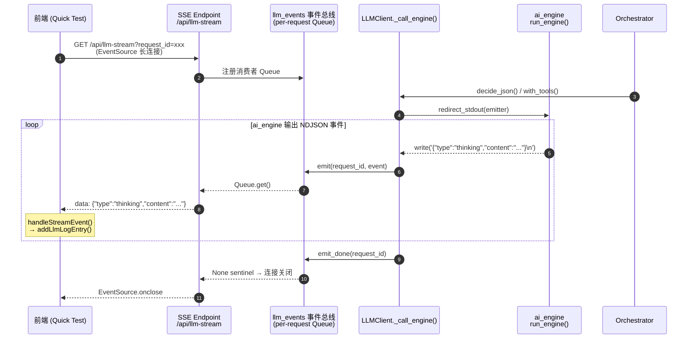
```mermaid
sequenceDiagram
    autonumber
    participant FE as 前端 (Quick Test)
    participant SSE as SSE Endpoint<br/>/api/llm-stream
    participant Bus as llm_events 事件总线<br/>(per-request Queue)
    participant LLM as LLMClient._call_engine()
    participant Eng as ai_engine<br/>run_engine()
    participant Orch as Orchestrator

    FE->>SSE: GET /api/llm-stream?request_id=xxx<br/>(EventSource 长连接)
    SSE->>Bus: 注册消费者 Queue

    Orch->>LLM: decide_json() / with_tools()
    LLM->>Eng: redirect_stdout(emitter)
    loop ai_engine 输出 NDJSON 事件
        Eng-->>LLM: write('{"type":"thinking","content":"..."}\n')
        LLM->>Bus: emit(request_id, event)
        Bus-->>SSE: Queue.get()
        SSE-->>FE: data: {"type":"thinking","content":"..."}
        Note over FE: handleStreamEvent()<br/>→ addLlmLogEntry()
    end

    LLM->>Bus: emit_done(request_id)
    Bus-->>SSE: None sentinel → 连接关闭
    SSE-->>FE: EventSource.onclose
```

**关键实现**:

| 组件 | 文件 | 职责 |
|------|------|------|
| `_StdoutEventEmitter` | `modules/llm/llm_client.py` | 包装 `StringIO` 缓冲区，`write()` 时同时解析 NDJSON 并 `emit()` 到事件总线 |
| `llm_events` 事件总线 | `modules/llm/llm_events.py` | thread-local `request_id` 上下文 + per-request `Queue[]` + SSE `stream()` 生成器 |
| `Orchestrator` | `modules/core/orchestrator.py` | `process_request()` 入口调用 `set_request_context()`，`finally` 调用 `llm_cleanup()` |
| SSE endpoint | `modules/app/routes.py` | `GET /api/llm-stream?request_id=xxx` 返回 `text/event-stream` 响应 |
| 前端 `EventSource` | `web/static/js/quick_test.js` | `startLlmStream()` 建立连接，`onmessage` → `handleStreamEvent()` → `addLlmLogEntry()` 渲染 |

#### 三条通路对比

| 维度 | ① 控制台 + 运行日志 | ② LLM 引擎日志 | ③ 快速测试 LLM 日志 |
|------|---------------------|-----------------|---------------------|
| **记录层** | 编排层 (Orchestrator/Tools) | 模型层 (ai_engine) | 模型层 (ai_engine) |
| **粒度** | 运行状态摘要 | 原始交互事件 | 原始交互事件 |
| **时效** | 持久化到文件 | 持久化到文件 | 仅内存（请求结束后清空） |
| **传输方式** | 同步写入 | 同步写入 | SSE 实时推送 |
| **查看入口** | Admin UI 运行日志 | Admin UI LLM 配置 | 快速测试页 LLM日志 |
| **适用场景** | 运维排查、整体流程追踪 | LLM 交互分析、调试 | 实时调试、观察 LLM 思考过程 |

> **注意**: 通路 ② 和 ③ 的数据来源相同（ai_engine NDJSON 事件），但通路 ② 由 ai_engine 内部写入文件，通路 ③ 由 LLMClient 在 stdout 拦截层实时推送到前端。两者互不干扰，配置 `llm.verbose=false` 会关闭通路 ② 但不影响通路 ③。

---

> **文档维护**: 本文档随代码迭代同步更新。架构图和时序图使用 Mermaid 语法，可在支持 Mermaid 的 Markdown 渲染器中直接查看。
